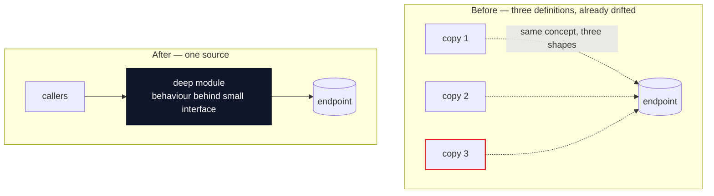

# Markdown Report Format

The architectural review is written as plain Markdown at `docs/codebase-guide.md` in the repo.
Diagrams are Mermaid fenced code blocks — GitHub, VS Code, and most Markdown viewers render them natively, so the report needs no CDN, no browser step, and diffs cleanly in git.
Put each full sentence on its own line so diffs between runs stay readable.

## Scaffold

```markdown
# Architecture review — {{repo name}}

_Deepening opportunities · {{date}} · {{one-line stack description}}_

{{2-4 sentence lede: how many candidates, the cross-cutting disease if there is one, whether CONTEXT.md/ADRs exist.}}

**Legend.**
module · seam · leakage · deep module · 🟢 Strong · 🟠 Worth exploring · ⚪ Speculative

---

## 1 · {{Candidate title — names the deepening}}

🟢 **Strong**

| File | Role |
|------|------|
| `path/to/file.ts:120-145` | what it does in this candidate |

{{before/after diagram — see patterns below}}

**Problem.**
{{1-3 sentences. What hurts, with evidence.}}

**Solution.**
{{1-2 sentences. What changes.}}

- {{win bullet, ≤6 words, glossary terms}}
- {{win bullet}}

---

{{...more candidates...}}

## Hygiene backlog

{{table of lint-level sweeps that are cleanup, not deepening}}

## Top recommendation

**Start with [candidate N — title](#anchor).**
{{One or two sentences on why.}}
```

## Header

Repo name, date, and the compact legend line.
No long introduction — a short lede, then straight into the candidates.
If a previous run's guide exists, keep its decision/implementation records: candidates that were decided, implemented, or rejected stay in the file as a status ledger (collapse them to their heading + status line + decision block), and new candidates continue the numbering or start a clearly-marked new round section.

## Candidate section

The diagrams and tables carry the weight.
Prose is sparse, plain, and uses the glossary terms ([LANGUAGE.md](LANGUAGE.md)) without ceremony.

Each candidate is one `##` section:

- **Title** — short, names the deepening (e.g. "Collapse the Order intake pipeline").
- **Strength line** — directly under the heading: 🟢 **Strong** · 🟠 **Worth exploring** · ⚪ **Speculative**. Append status when known (e.g. `· ✅ implemented` · `· ❌ rejected, see ADR-0007`).
- **Files** — a Markdown table of `path:lines` → role, or a short monospaced list.
- **Before / After diagram** — the centrepiece. See patterns below.
- **Problem** — one to three sentences. What hurts, with file:line evidence.
- **Solution** — one or two sentences. What changes.
- **Wins** — bullets, ≤6 words each, in glossary terms: "locality: payload fields in one module", "leverage: one interface, N call sites", "deletion test: 7 copies → 1".
- **ADR callout** (if applicable) — one blockquote line: `> ⚠️ contradicts ADR-0007 — but worth reopening because…`

No paragraphs of explanation.
If the diagram needs a paragraph to be understood, redraw the diagram.

## Diagram patterns

Pick the pattern that fits the candidate. Mix them — variety is part of the point.

### Mermaid before/after subgraphs (the workhorse)

Two subgraphs in one flowchart, `before` and `after`, so the shallowness and the deepening sit side by side.
Colour leakage edges/nodes red and the deep module dark via `classDef`.

````markdown

````

### Mermaid sequence diagram

Best for temporal contracts and round-trip comparisons: "before: caller must remember to call X after every mutation; after: the store reacts."

### Divergence table (when the point is drift, not shape)

When two copies of the same module have measurably diverged, a table beats any diagram:

```markdown
| | Copy A (`fileA.vue`) | Copy B (`fileB.vue`) |
|---|---|---|
| number write | ✅ `chooseNumber()` intent | ❌ raw field pokes |
| price label | ✅ `price.toFixed(2)` | ❌ raw price |
```

Mark the diverged cells with ✅/❌ so the drift is scannable.

### Interface-width list (mass diagram substitute)

For "interface as wide as implementation", list the interface members in a code block — twenty `setX` names in a row make the shallowness visible without a drawing.

## Style guidance

- Each full sentence on its own line (clean git diffs between runs).
- Keep Mermaid diagrams small — roughly ≤12 nodes; split into two diagrams rather than growing one.
- `---` rules between candidates.
- Use `file.ts:line` references everywhere — they're clickable in most viewers.
- No HTML tags beyond what Mermaid labels need (`<br/>` inside node labels is fine).
- Emoji only where the scaffold uses them (strength badges, ✅/❌ divergence marks, ⚠️ ADR callouts).

## Top recommendation section

One short paragraph.
Candidate name (anchor-linked), one or two sentences on why it's first, and the natural second and third picks.

## Tone

Plain English, concise — but the architectural nouns and verbs come straight from [LANGUAGE.md](LANGUAGE.md).
Concision is not an excuse to drift.

**Use exactly:** module, interface, implementation, depth, deep, shallow, seam, adapter, leverage, locality.

**Never substitute:** component, service, unit (for module) · API, signature (for interface) · boundary (for seam) · layer, wrapper (for module, when you mean module).

**Phrasings that fit the style:**

- "Order intake module is shallow — interface nearly matches the implementation."
- "Pricing leaks across the seam."
- "Deepen: one interface, one place to test."
- "Two adapters justify the seam: HTTP in prod, in-memory in tests."

**Wins bullets** name the gain in glossary terms: _"locality: bugs concentrate in one module"_, _"leverage: one interface, N call sites"_, _"interface shrinks; implementation absorbs the wrappers"_.
Don't write _"easier to maintain"_ or _"cleaner code"_ — those terms aren't in the glossary and don't earn their place.

No hedging, no throat-clearing, no "it's worth noting that…".
If a sentence could be a bullet, make it a bullet.
If a bullet could be cut, cut it.
If a term isn't in [LANGUAGE.md](LANGUAGE.md), reach for one that is before inventing a new one.
